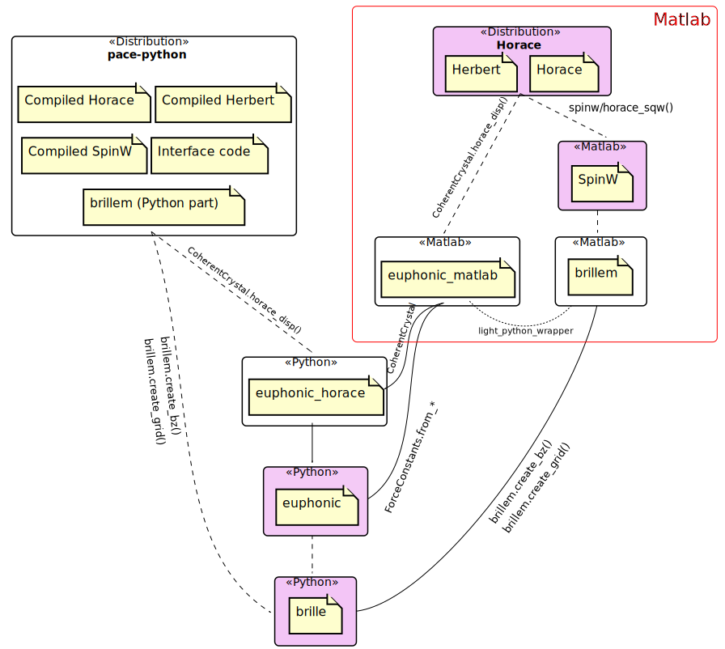

# PACE framework

[Introduction](#introduction)

[Dependencies](#dependencies)

[`euphonic_horace`](#euphonic_horace)

[Naming](#naming)

[Appendix: Project Descriptions](#appendix-project-descriptions)

## Introduction

PACE comprises several independent programs which may interact with each other.
This document defines how each program is expected to call the others, and especially the interfacing layers between the programs.

## Dependencies

The above diagram shows the dependencies of the various PACE projects.
Arrows point from the dependent package to its dependency (e.g. `brillem` is dependent on `brille`).
Solid arrows indicate a required dependency, whilst dashed arrows are optional dependencies
(e.g. `pace-python` is only dependent on `euphonic_horace` for phonon calculations using Euphonic).

Only projects which are publicly facing (where users can download a distributed package/toolbox/module) are shown.
The two interface packages `euphonic_matlab` and `brillem` both depend on a separate library `light_python_wrapper`
which they import as a git submodule.
`light_python_wrapper` is a Matlab library which allows Matlab to access Python classes or objects
as if they are Matlab objects or classes transparently.
`light_python_wrapper` might be made a public Matlab toolbox at a later date.

Horace, Euphonic, SpinW and Brille are separate projects / programs and highlighted in purple.
Their descriptions are listed in the [appendix](#appendix-project-descriptions).

`euphonic_matlab`, `euphonic_horace` and `brillem` are interfaces which connect the main programs.

`pace_python` is a Python module which bundles the Matlab programs Horace and SpinW so Python users can use them.

## Interfaces

* `euphonic_matlab` is a Matlab toolbox which allows Matlab users to use Euphonic.
    - It has two anticipated uses:
        + To allow Matlab users to run Euphonic as a stand alone program (to calculate density of states, generate dispersion plots etc.)
        + To allow Horace to use Euphonic to simulate phonon spectra
* `euphonic_horace` is a Python module which translates the output of Euphonic into the form specified by the 
  [Horace third part simulation code API](../../optimisation/design/Third_Party_API_Design.md)
  and also packages together different functionalities of Euphonic to make it easier for Horace users to use.
    - `euphonic_horace` is need by `euphonic_matlab` in the second use case (use by Horace) but not the first (use stand-alone).
    - `euphonic_horace` is also needed by `pace-python` for this use case (use by Horace).
* `brillem` is a Matlab toolbox which allows Matlab users to use Brille.
* It has two anticipated uses:
    - To allow Matlab users to run Brille stand-alone for symmetry calculations and Brillouin zone plotting
    - To allow SpinW to use Brille for Brillouin zone interpolation.
* `brillem` currently has both Matlab and Python code, and is equivalent to a combination of `euphonic_matlab` and `euphonic_horace`.
* This combination of `euphonic_matlab` and `euphonic_horace` is the current `horace-euphonic-interface` repository
  which is proposed to be split due to versioning issues between the Matlab and Python code.
* `pace-python` requires the Python part of `brillem` but not the Matlab part and currently pulls the `brillem` repository to obtain it.
* It is hoped that the Python parts of `brillem` could be merged into the main `brille` codebase instead.

## `euphonic_horace`

The `euphonic_horace` module is thought to be a little superfluous and it has been proposed to remove it.
This could be done in a few different ways:

* Remove `euphonic_horace`, splitting and duplicating the code in  `pace-python` and Horace.
    - Pro: one less package which can confuse users, and perhaps simplify the integration pipeline.
    - Con: code duplication
    - Con: Horace is a large program with a long test time, changes to the Euphonic interface would require more developer effort 
      than in a separate repository.
* Remove `euphonic_horace`, putting the code into `euphonic_matlab`.
    - Pro: one less package which can confuse users, and perhaps simplify the integration pipeline.
    - Con: `euphonic_matlab` would have both Python and Matlab code and needs two different versions for each language.
        + git allows only a single version tag so would need to enfore a mechanism where Matlab code changes
          would change the subminor version number whilst Python code changes increment the minor or major version number.
    - Con: `pace-python` would download the `euphonic_matlab` package and extract the Python code (it does not need the Matlab code).
        + makes the build script slightly more complex (but not much).
* Remove `euphonic_horace`, moving the current Python code into `pace-python` and resurrect/reimplement a Matlab equivalent in `euphonic_matlab`.
    - Pro: one less package which can confuse users, and perhaps simplify the integration pipeline.
    - Con: code duplication (have different Python and Matlab implementations of the same functionality)
    

## Naming

Some project names, particularly `pace-python`, `euphonic_horace` and `euphonic_matlab` are thought to be lacking.
Some suggested alternatives are:

* For `pace-python`: `snakeskin`, `pacy`, `pace-neutron`
* For `euphonic_horace`: `euphonic_horace_interface_python`, `euphonic_sqw`, `euphonic_horace_driver`
* For `euphonic_matlab`: `euphonic_horace_interface_matlab`, `euphonium`, `meuphonic`

## Appendix: Project Descriptions

* The "Horace distribution" packages the `horace` and `herbert` repositories for Matlab users.
  It is a program to visualise and analyse single crystal inelastic neutron spectra from time-of-flight spectrometers.
* The `pace-python` distribution is the equivalent of the "Horace distribution" aimed at Python users.
  It packages compiled versions of the `horace`, `herbert` and `spinw` repositories together with Python and `mex` glue/interface code.
  Part of the interfacing code is a separate implementation of `euphonic_matlab` and `brillem`
  which does not use `light_python_wrapper` and is not suitable for Matlab users
  (it requires a `mex` file which only works for the "compiled Matlab as a Python module" set-up of `pace-python`).
* `spinw` is a Matlab program to calculate spin-wave dispersions and spin-spin correlation functions.
* `euphonic` is a Python program to calculate phonon dispersions and structure factors from DFT-calculated force constants.
* Both SpinW and Euphonic may be used stand-alone without Horace.
* `brille` is a C++/Python program to calculate symmetry operations and interpolation in the first Brillouin zone.
    - It can be used as a standalone program for symmetry calculations and Brillouin zone plotting.
    - But its major anticipated use is within Euphonic and SpinW for speeding up their calculation using Brillouin zone interpolation.
* Both Euphonic and SpinW will have code internally to call Brille if it is installed and the user requests it.
