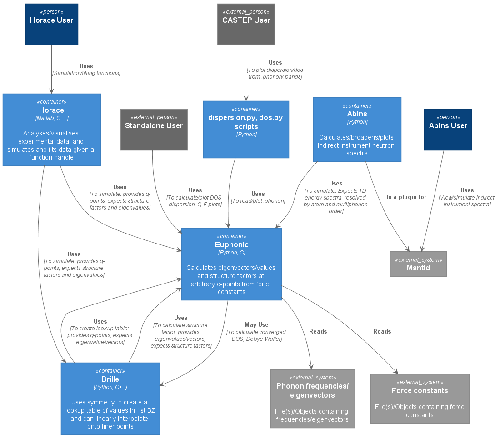
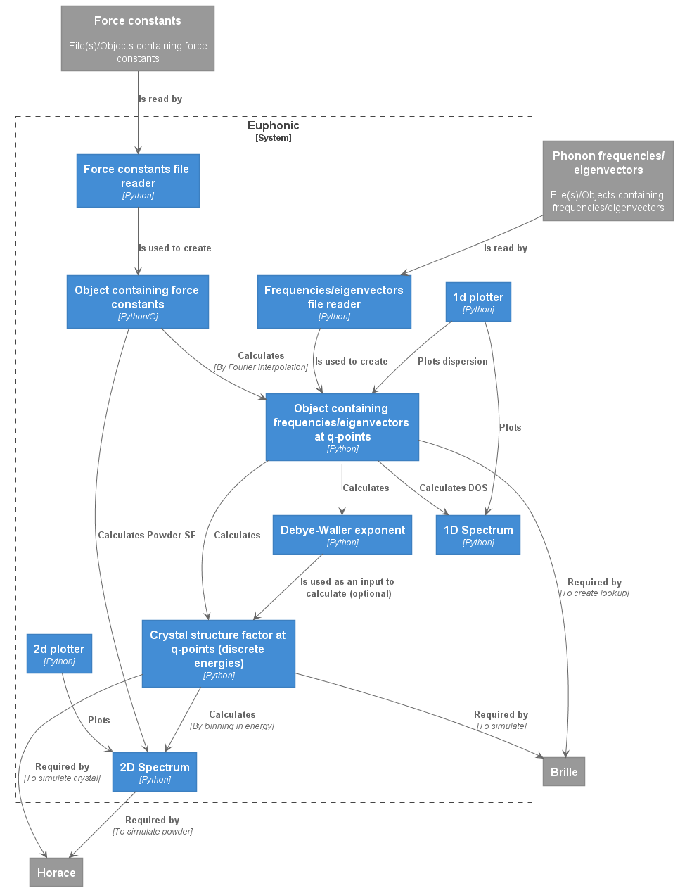

# Euphonic v0.3 Design Document

# Requirements and Context
Euphonic is a piece of software developed under PACE to simulate inelastic
neutron scattering data for phonons calculated from a force constants matrix.
There are 3 main use cases (+1 that should be considered), each with their own
requirements:

## 1. Horace/Brille

Horace has several simulation functions that require a handle to a user function
which has certain defined inputs and outputs. `disp2sqw` requires a user
function that should take a list of 3d q-points as input and return a list of
structure factors and frequencies for each phonon mode and q-point, which
Euphonic should be able to provide. Euphonic uses Fourier interpolation to
calculate phonons at every q-point which is accurate but expensive, so another
piece of software is being developed, Brille, which will use Euphonic to create
a lookup table of phonon eigenvectors and frequencies, which can be used to
cheaply get frequencies and eigenvectors on a finer grid via linear
interpolation. The structure factor can then be calculated on this finer grid
(calculating the structure factor is much cheaper than calculating the
frequencies/eigenvectors). The hierarchy of Horace/Brille/Euphonic is not yet
decided so Euphonic must be flexible. In addition, in the future there is scope
to calculate the structure factor for powder samples, this also needs to be
considered. From this the requirements are:

- Euphonic must be able to take a list of q-points as input, and return the
crystal structure factor, and phonon frequencies for each q-point
- Euphonic must allow creation of an object containing phonon frequencies and
eigenvectors at q-points, from which the crystal structure factor can be
calculated
- Euphonic must allow for future calculation of a powder structure factor, which
would be along scalar q, and binned in energy
- Euphonic must run with a Python version that is compatible with the latest
versions of Matlab (2019b supports 2.7, 3.6 and 3.7)
- Euphonic should use packages that are compatible with Matlab, or have suitable
workarounds (e.g Numpy is not officially supported by Matlab, but with correct
library loading flags it does work)

## 2. Abins

[Abins](https://docs.mantidproject.org/nightly/algorithms/Abins-v1.html) is a
Mantid plugin that allows plotting of experimental and simulated incoherent INS
spectra for (usually powdered) molecular crystals, for indirect geometry
instruments. Euphonic could improve the simulated spectra in Abins by allowing
calculations to be made from data at any q, and provide a good platform for
methods development. Abins will still implement its own plotting and instrument
specific broadening and handle interaction with Mantid.

In the literature these molecular crystal vibrations are usually separated into
'internal' molecular vibrations (which are assumed to be flat) and 'external'
vibrations (translations or rotations of the entire molecule). Currently Abins
assumes all vibrations are flat (no dispersion) and employs semi-analytic powder
averaging ([1]) up to 4th order multiphonon interactions. This could
potentially be improved by integrating the eigenvectors over the Q accessible by
the instrument, rather than assuming a flat bandstructure, but the exact method
for doing this is not yet clear. If may also be beneficial to perform a
numerical powder average rather than semi-analytical, but this may make
calculating higher order interactions prohibitively expensive, and needs to be
investigated. These calculations should produce a 1D spectrum in energy,
resolved per atom and quantum order. For Euphonic to be useful to Abins, the
requirements are:

- Euphonic must be able to produce a 1D energy-binned incoherent spectrum
resolved per atom and quantum order
- Euphonic must run with versions of Python that are shipped with Mantid (as of
Mantid 4.3.0 Python 3.6, 3.7, 3.8)

[1] P. C. H. Mitchell, S. F. Parker, A. J. Ramirez-Cuesta, J. Tomkinson, *Vibrational Spectroscopy With Neutrons*, World Scientific Publishing Co. Pte. Ltd., Singapore, 2005, 559-562
 
## 3. Standalone (via Python API)

Being able to efficiently calculate phonon frequencies and structure factors at
arbitrary q-points is potentially useful beyond just the users of Horace and
Abins e.g. calculating density of states, doing simple plotting from CASTEP's
.phonon files. Because of this, there are several extra requirements that will
enable Euphonic to be a useful standalone package:

- The Python API should be clear and consistent (even if this means being
slightly more verbose)
- Functions that produce new data should return immutable, compartmentalised
data objects rather than modifying the input object
- Units should be handled carefully and be explicit
- We should provide simple plotting functions
- We should provide functions to serialise data objects (e.g to_dict, to_yaml)
- We should provide functions to create data objects from these serialised
formats (e.g. from_dict, from_yaml)

## 4. For consideration: CASTEP dispersion.pl/dos.pl replacements

Although not a requirement of PACE, some of Euphonic was initially developed to
replace CASTEP's dispersion.pl/dos.pl scripts, which can plot a simple
dispersion or DOS from CASTEP .phonon or .bands files. This is why the BandsData
object and Grace plotting functions exist in
[v0.2.2](01_design_overview_v0.2.2.md). 

It has been decided this functionality will move to a separate repository,
maintained and distributed from the CASTEP side of things. That repository can
be found [here](https://bitbucket.org/castep/dispersiondos/src/master/).
Having helper scripts to allow plotting and simple interpolation from the
command line is also useful to Euphonic, so scripts could be developed within
Euphonic, but in such a way that allows them to be wrapped so the extra .bands
reading and Grace plotting functionality can be easily added without code
duplication.

Maintaining compatibility with CASTEP scripts and their requirements should be
considered, but not a priority that should restrict Euphonic development, as the
above scripts may not require new Euphonic features and could always depend on a
specific version.

## Context Diagram



# Current Solution and Shortcomings

See [v0.2.2 overview](01_design_overview_v0.2.2.md)

# Proposed Solution

## Euphonic Data Flow



Note: The method for calculating the powder structure is still being developed,
so the details of the powder structure factor may change

## Euphonic Data Objects

### Structure
The cell structure is an important piece of data describing the material, and is
required for many of the objects to do further calculations. It was not
explicitly included in the above diagrams for simplicity, but `Structure` will
be used in further object descriptions and has the following attributes:
|Attribute|Type|
|---------|----|
|Cell vectors| Quantity wrapped (3,3) float numpy.ndarray|
|Number of ions|int|
|Ion coordinates (fractional)|(n_ions, 3) array of floats|
|Ion types|(n_ions,) list of strings|
|Ion masses| Quantity wrapped (n_ions,) float numpy.ndarray|
|Cell vector unit|string|
|Ion mass unit units|string|

Methods required for this object are:

|Method|Other Input required|Output|
|------|--------------|------|
|Calculate reciprocal lattice|-|Reciprocal lattice ((3,3) array of floats)|
|Calculate cell volume|-|Cell volume (float)|
|Serialise|Filename|File|

### Force Constants

Force constants can be Fourier interpolated to calculate frequencies and
eigenvectors at any q-point, it is therefore Euphonic's main data object and can
be used to create most others. Force constants are calculated by an external
code (e.g. CASTEP, Phonopy) and read to create this object. Force constants are
useless on their own and require extra structure data (read in along with the
force constants). The attributes required for this object are:

|Attribute|Type|
|---------|----|
|Structure| Structure object|
|Force constants|(n_cells, 3\*n_ions, 3\*n_ions) array of floats|
|Cell origins|(n_cells, 3) array of ints|
|Supercell matrix|(3, 3) array of ints|
|Born charges (optional)|(n_ions, 3, 3) array of floats|
|Dielectric permittivity tensor (optional)|(3, 3) array of floats|
|Force constants unit|string|
|Born charges unit|string|
|Dielectric permittivity unit|string|

Methods required on this object are:

|Method|Other Input required|Output|
|------|--------------|------|
|Calculate phonon frequencies/eigenvectors (see [algorithms - 1.](04_algorithms.md))|Q-points|Phonon Data|
|Calculate powder structure factor|Energy bins, \|Q\|-bins, neutron scattering lengths, temperature, Debye-Waller exponent(optional)|2D Spectrum object|
|Serialise|Filename|File|

### Phonon Data (at q-points)

This contains phonon frequencies/eigenvectors calculated at arbitrary q-points.
For dielectric materials, at the gamma point the frequencies are different
depending on the direction of approach (LO-TO splitting). This should be
included on dispersion plots so there must be a mechanism to contain the
duplicated frequencies/eigenvectors at gamma points. They are contained in
separate arrays, with an extra indexing array to determine which q-point they
belong to.

|Attribute|Type|
|---------|----|
|Structure|Structure object|
|Number of q-points|int|
|Q-points|(n_qpts, 3) array of floats|
|Q-point weights|(n_qpts,) array of floats|
|Frequencies|(n_qpts, 3*n_ions) array of floats|
|Eigenvectors|(n_qpts, 3*n_ions, n_ions, 3) array of complex floats|
|Split frequencies| (n_gamma_points, 3*n_ions) array of floats|
|Split eigenvectors|(n_gamma_points, 3*n_ions, n_ions, 3) array of complex floats|
|Gamma point indices|(n_gamma_points,) array of ints| 
|Energy unit|string|
|Structure factor unit|string|

|Method|Input required|Output|
|------|--------------|------|
|Calculate crystal structure factor (see [algorithms - 2.1](04_algorithms.md))|Neutron scattering lengths, temperature, Debye-Waller exponent (optional)|Crystal structure factor (discrete energies)|
|Calculate Debye-Waller exponent (see [algorithms - 3.2](04_algorithms.md))|Temperature|Debye-Waller exponent|
|Calculate density of states|Energy bins, energy broadening|1D Spectrum object|
|Serialise|Filename|File|

### Crystal Structure Factor (discrete energies)

This contains the structure factor calculated for a crystal at each q-point and
for each mode. It could be passed to Brille or Horace for energy binning and
plotting, or binned and plotted in Euphonic.

|Attribute|Type|
|---------|----|
|Q-points|(n_qpts, 3) array of floats|
|Structure factor|(n_qpts, 3*n_ions) array of floats|
|Frequencies|(n_qpts, 3*n_ions) array of floats|
|Structure factor unit|string|
|Energy unit|string|

|Method|Input required|Output|
|------|--------------|------|
|Calculate binned crystal structure factor (see [algorithms - 2.2](04_algorithms.md))|Energy bins, temperature (optional)|2D Spectrum object|
|Serialise|Filename|File|

### Debye-Waller exponent

The Debye-Waller exponent is calculated as a sum over the 1st BZ, so requires
frequencies and eigenvectors that have been calculated on a grid. It is also
direction dependent, and resolved per ion, so will be a 3x3 array for each ion
in the structure.

It is used as an input for the structure factor calculations, this could be
optional but is needed if the user wants to include temperature effects.

|Attribute|Type|
|---------|----|
|Structure|Structure object|
|Temperature|float|
|Debye-waller|(n_ions, 3, 3) array of floats|
|Debye-waller unit|string|
|Temperature unit|string|

|Method|Input required|Output|
|------|--------------|------|
|Serialise|Filename|File

### 2D Spectrum

This is an object for any 2D binned spectra, and can be plotted or exported to
another program. It is intended to be general and can be used for binned crystal
Q-E plots, powder |Q|-E plots etc. The x-tick labels have been
included to allow helpful labelling of the x-axis, which is most often the
Q-axis (e.g. high symmetry points), and as the structure/q-point information is
not included in the 2D spectrum object these cannot be calculated on the fly.
The labels are a list of tuples, each tuple consists of an integer specifing the
location (which is an index of a bin center) and a string with the label
contents. For parity it could be sensible to include y tick labels, but until
Q-Q plots are a Euphonic requirement, these are not included in the current
object definition.

|Attribute|Type|
|---------|----|
|x bin edges|(n_xbins + 1) array of floats|
|x bin unit|string|
|x tick labels| list of (int, string) tuples|
|y bin edges|(n_ybins + 1) array of floats|
|y bin unit|string|
|plot data|(n_xbins, n_ybins) array of floats|
|plot data unit|string|

|Method|Input required|Output|
|------|--------------|------|
|Serialise|Filename|File|

### 1D Spectrum

This is an object for any 1D binned spectra, and can be plotted or exported to
another program. It is intended to be general and can be used for DOS,
dispersion, and slices through 2D spectra. Again, x tick labels/locations are
included for labelling of high-symmetry points for dispersion plotting.

|Attribute|Type|
|---------|----|
|x bin edges|(n_xbins + 1), array of floats|
|x bin unit|string|
|x tick labels| list of (int, string) tuples|
|y axis unit|string|
|plot data|(n_xbins,) array of floats|
|plot data unit|string|

|Method|Input required|Output|
|------|--------------|------|
|Serialise|Filename|File|

## Python data object types

Many of the objects above contain extra data (e.g. structure information) that
is required for the other data to make sense. The Force Constants and Phonon
Data objects are the ones that do complex calculations, so they must be full
Python `classes`. The other objects have at least 1 associated method (even if
it is just serialisation). So there are 2 main options for these objects:
`classes` and [`dataclasses`](https://docs.python.org/3/library/dataclasses.html).
A simple prototype for the case of the Structure object has been created for
each case, using atomic units internally and properties to convert units for
user access (as described in the [units](#units) section), and providing methods
to input/output from/to a dictionary. 

```
from dataclasses import dataclass, field, InitVar, asdict
import numpy as np
from euphonic import ureg


@dataclass
class StructureDataclass:

    cell_vectors_init: InitVar[ureg.Quantity]
    n_ions: int
    ion_r: np.ndarray
    ion_type: np.ndarray
    ion_mass_init: InitVar[ureg.Quantity]

    cell_vectors: ureg.Quantity = field(init=False)
    ion_mass: ureg.Quantity = field(init=False)
    cell_vectors_unit: str = field(init=False)
    ion_mass_unit: str = field(init=False)

    def __post_init__(self, cell_vectors_init, ion_mass_init):
        self._cell_vectors = cell_vectors_init.to(
            ureg.INTERNAL_CELL_VECTORS_UNIT).magnitude
        self._ion_mass = ion_mass_init.to(ureg.DEFAULT_ION_MASS_UNIT).magnitude
        self.cell_vectors_unit = str(cell_vectors_init.units)
        self.ion_mass_unit = str(ion_mass_init.units)

    @property
    def ion_mass(self):
        return self._ion_mass*ureg('DEFAULT_ION_MASS_UNIT').to(
            self.ion_mass_unit)

    @property
    def cell_vectors(self):
        return self._cell_vectors*ureg('INTERNAL_CELL_VECTORS_UNIT').to(
            self.cell_vectors_unit)

    @ion_mass.setter
    def ion_mass(self, ion_mass: ureg.Quantity):
        pass

    @cell_vectors.setter
    def cell_vectors(self, cell_vectors: ureg.Quantity):
        pass

    def to_dict(self):
        d = asdict(self)
        for key, val in d.items():
            try:
                d[key] = val.magnitude
            except AttributeError:
                pass
        return d

    @classmethod
    def from_dict(cls, d):
        mu = d['ion_mass_unit']
        lu = d['cell_vectors_unit']
        return cls(d['cell_vectors']*ureg(lu), d['n_ions'], d['ion_r'],
                   d['ion_type'], d['ion_mass']*ureg(mu),
                   output_cell_vectors_unit=lu, output_ion_mass_unit=mu)


class StructureClass(object):

    def __init__(self, cell_vectors, n_ions, ion_r, ion_type, ion_mass):
        self._cell_vectors = cell_vectors.to(
            ureg.INTERNAL_CELL_VECTORS_UNIT).magnitude
        self.n_ions = n_ions
        self.ion_r = ion_r
        self.ion_type = ion_type
        self._ion_mass = ion_mass.to(ureg.INTERNAL_ION_MASS_UNIT).magnitude

        self.cell_vectors_unit = str(cell_vectors.units)
        self.ion_mass_unit = str(ion_mass.units)
                
    @property
    def cell_vectors(self):
        return self._cell_vectors*ureg('INTERNAL_CELL_VECTORS_UNIT').to(
            self.cell_vectors_unit)

    @property
    def ion_mass(self):
        return self._ion_mass*ureg('DEFAULT_ION_MASS_UNIT').to(
            self.ion_mass_unit)

    def to_dict(self):
        d = vars(self).copy()
        d['cell_vectors'] = d.pop('_cell_vectors')*ureg(
            'INTERNAL_CELL_VECTORS_UNIT').to(self.cell_vectors_unit).magnitude
        d['ion_mass'] = d.pop('_ion_mass')*ureg(
            'INTERNAL_ION_MASS_UNIT').to(self.ion_mass_unit).magnitude
        return d

    @classmethod
    def from_dict(cls, d):
        mu = d['ion_mass_unit']
        lu = d['cell_vectors_unit']
        return cls(d['cell_vectors']*ureg(lu), d['n_ions'], d['ion_r'],
                   d['ion_type'], d['ion_mass']*ureg(mu))
```

As can be seen above, the plain Python class actually requires fewer lines of
code (37 vs. 55). The pattern of having `_cell_vectors` and `_ion_mass`
internally in atomic units, with corresponding `cell_vectors` and `ion_mass`
properties that wrap and convert before showing to the user, is actually quite
difficult to implement in a Python `dataclass` and requires a lot of boilerplate
that most Python developers won't be familiar with, unless they have used
dataclasses extensively before. It appears Python dataclasses are best at
storing input data as is, and maybe deriving a few attributes, rather than
converting the input data. As a result, it may actually be better to have all
the data objects be full Python classes.

One advantage of `dataclasses` is the automatically generated `__repr__` method,
which can nicely display the object contents. However, many objects (e.g. ones
that contain per q-point data) would be too large to sensibly display like this
anyway. `dataclasses` can also provide automatic `__eq__`, `__lt__` etc.
methods, but these don't really make sense with our data.

Given the above, all of the data objects in Euphonic should be full Python
classes.

### Alternatives
[**NamedTuple**](https://docs.python.org/3/library/typing.html#typing.NamedTuple) - 
Typed `typing.NamedTuple` or untyped `collections.namedtuple` were considered
as a possible alternative because they have attribute access, can contain all
the required data and could be subclassed to add methods. However, they were not
chosen as they require more boilerplate to subclass, are not as flexible, and
although immutability could be seen as an advantage as it guarantees the data
will not change, this could have unforseen restrictions/inefficiencies in the
future. In addition many features of `typing.NamedTuple` were not added until
`3.6` so version restrictions would be similar

**Class** - Regular Python classes were a potential option as they could satisfy
all requirements of containing data and having methods, but might be
overkill for some very simple data objects such as DOS, contain lots of
boilerplate code, and therefore be more difficult to maintain.

**Dictionary** - Dictionaries could contain all the required data, but as they
are not a class won't have an obvious type so the user would have to inspect the
keys to see what it contains. In addition, any functions for this data would
have to lie elsewhere in the code, and dictionary access (`obj['a']`) would
clash syntactically with attribute access (`obj.a`) elsewhere.

**Numpy Array** - Very simple, but wouldn't be able to bundle associated data
together and would require the user to keep track of this. For serialisation,
plotting, further calculations the user would have to pass all pieces of
required data as arguments which is messy and likely to cause errors.

## Units
Units in Euphonic will be handled by the [`Pint`](https://pint.readthedocs.io)
package. This provides a large list of unit conversions that will not have to be
maintianed by Euphonic, and allows for addition of custom units. It handles
units by wrapping values (even Numpy arrays) in a `Quantity` object which has
both a magnitude and unit, and provides methods for easy conversion. One thing
to note is doing repeated operations on `Quantity` objects can reduce
performance, so it is best to convert to a bare magnitude first.

Internally for calculations Euphonic will use
[**Hartree atomic units**](https://en.wikipedia.org/wiki/Hartree_atomic_units).
This means the units are:

- length: bohr radius
- mass: electron mass
- energy/frequency: hartree
- charge: electron charge

Using `Pint >= 0.10.1` units can be aliased and added to the unit registry which
allows a record of the default user-facing and internal units to be kept. For
example `INTERNAL_CELL_VECTORS_UNIT` can be defined:
```
ureg.define('@alias bohr = INTERNAL_CELL_VECTORS_UNIT')
```
Which is what is used to create the `ureg` in the above Structure example.

Inside Euphonic's data objects, all pieces of data with units are stored as a
bare magnitude, implicitly in atomic units. For example, in the Structure class
above `_cell_vectors` is a  'private' attribute which is stored as a plain Numpy
array in units of bohr radius. The user-facing attribute is `cell_vectors` which
is a property that converts the `_cell_vectors` to whatever unit is stored in
the `cell_vectors_unit` attribute (e.g. Angstrom) and outputs a `Quantity` to
the user which makes the units explicit. The output unit can be changed by
changing the `cell_vectors_unit` attribute, this could be wrapped as a property
to check for valid units before being set.

When instantiating an object directly with the constructor, the user is expected
to provide any data containing units as a `Quantity` specifying the units. The
default units for that object will then be the same as whatever was input.

When outputting to/taking input from another data format e.g. dictionary or
file, `Quantity` objects are not used to increase portability. Instead, any data
with units will be output as 2 fields: 1 containing the data, and 1 containing a
string specifying the units. For example, in the Structure class above, when
converting `cell_vectors` to a dictionary, the dictionary will contain:
```
'cell_vectors': array([[ 1.50755587e-13, -2.61116331e-13,  0.00000000e+00],
                       [ 1.50755587e-13,  2.61116331e-13,  0.00000000e+00],
                       [ 0.00000000e+00,  0.00000000e+00,  3.32452478e-13]])
'cell_vectors_unit': 'angstrom'
```

## Plotting
Plotting functions will be contained in their own separate module, so that
libraries such as `Matplotlib` will only be imported if a user wants to plot,
and not required for general data analysis. In addition, a user may want to plot
several Spectrum objects on the same axes, which requires plotting be done from
a separate module rather than called as method on the Spectrum object. 

Plotting in Euphonic will be fairly simple, as it is not Euphonic's main goal,
and will be mainly useful for debugging and quick sanity checking of answers. 

## Serialisation
For both easy testing and export to other programs, Euphonic will need to be
able to serialise most of its data objects. They should each have their own
methods, although it is not decided what formats should be supported and more
may be added later. Initial support could be for one of: 

- `yaml`: human readable, Phonopy uses it so `pyyaml` is is already a dependency
- `json`: human readable, Python has built-in json module, may represent objects
better