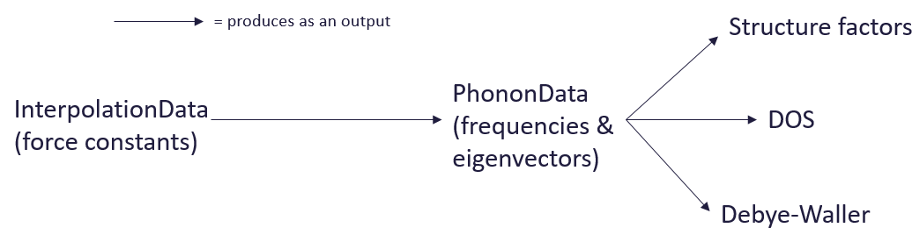

# Design proposal (from v0.2.2 ->)

# Overview of data structures

Items in bold havent yet been implemented. Items with ? are up for debate.

|Entity       |Associated attributes          |What we want to do with the data|
|-------------|-------------------------------|--------------------------------|
|Object containing force constants|cell vectors<br>ion types<br>ion coordinates<br>ion masses<br>supercell matrix<br>cell coordinates (within supercell)<br>born charges<br>dielectric<br>**meta_info?**|Calculate phonons at q<br>**Calculate powder structure factor**<br>**Calculate indirect geometry structure factor**<br>**Tweak force constants**<br>**Serialise**|
|Object containing frequencies/eigenvectors at q-points|cell vectors<br>ion types<br>ion coordinates<br>ion masses<br>q-points<br>weights<br>frequencies<br>eigenvectors<br>**meta info?**|Calculate Debye-Waller<br>Calculate DOS<br>Calculate crystal structure factor<br>Plot dispersion<br>**Serialise**|
|**Object containing frequencies/eigenvectors on a grid?**|Q-bins in xyz?<br>...|**Calculate Debye-Waller?**<br>**Calculate DOS?**<br>...|
|Debye-Waller factor|DW itself (shape (n_ions, 3, 3))<br>temperature<br>cell vectors?<br>ion coordinates?<br>ion types?|Input to structure factor function<br>**Serialise**|
|Density of states|DOS itself<br>energy bins|Plot<br>**Serialise**|
|Coherent crystal structure factor|structure factor itself<br>frequencies<br>q-points|Bin data (to create S(q,w))<br>**Serialise**|
|Binned coherent crystal structure factor (S(Q,w))|binned structure factor values<br>energy bins<br>q-points|Plot<br>**Serialise**|
|**Coherent powder structure factor**|binned structure factor values<br>energy bins<br>modq bins|**Plot**<br>**Serialise**<br>|
|**Indirect geometry structure factor?**|binned structure factor values<br>E(q) bins?<br>|**Plot**<br>**Serialise**|

# Proposed changes
**'Immutable' objects producing data as output**

Given there could be a variety of different structure factors, and they could
be binned or unbinned, storing this all in the same object could easily become
messy and inconsistent. Objects, where possible, should be 'immutable' and
output calculated data rather than storing it as an attribute. This means that
`InterpolationData` will no longer be a subclass of `PhononData`, won't contain
any frequencies and will instead output a `PhononData` object from
`calculate_fine_phonons`. See below image for an example:




**Remove BandsData and Grace plotting**

The `BandsData` object containing electronic frequencies doesn't
really fit in with the rest of the code and only exists to replicate CASTEP's
scripts. The same for the Grace plotting functions.

**RENAME THINGS**

All object/function names are negotiable:
- The names of `InterpolationData`, `PhononData` may not immediately make it
obvious what each of these objects contain.
- Are the phrases `structure_factor`, `sqw_map` etc. clear and sufficiently
neutral terms? Would something like e.g. `ins_intensity` be better or worse?

# Data containers
It needs to be decided what type of object the data outputs (structure factors,
Debye-Waller, DOS etc.) should be in. They could be plain Numpy arrays,
dictionaries, named tuples or classes.

| |Advantages|Disadvantages|
|-|----------|-------------|
|Numpy Arrays|- Easy to make<br>- Easy to serialise|- No associated data (e.g. q-points) so might not make sense on its own, and users would have to pass their own metadata into functions for e.g. plotting, which may result in nonsense<br>- Mutable|
|Dictionary|- Easy to make<br>- Easy to serialise<br>- All associated data can be contained in the dict, can just pass it to plotting/serialising functions|-Accessing data via keys clashes syntactically with class attribute access (`dict['a']` vs. `obj.a`)<br>- Have to access (serialisation) functions from other parts of the package e.g. `euphonic.serialise.dump_dos(dos)`<br>- Mutable|
|Named tuple|- Easy to make<br>- All associated data contained in tuple<br>- Attribute access (`obj.a`)<br>- It's obvious from the named tuple 'type' what the object is supposed to contain<br>- Can be upgraded to class later<br>- Immutable|- Have to access (serialisation) functions from other parts of the package e.g. `euphonic.serialise.dump_dos(dos)`<br>- Immutable, must make a copy to change anything|
|Class|- Can contain all associated data in class<br>- Can manage attribute access via properties<br>- Can have serialisation, plotting class methods (e.g. `dos.plot(), dos.to_hdf5()`)|- May be unnecessarily complex<br>- Adds (more) maintenance overhead<br>- Not very Pythonic|
|Python Dataclasses|- Can contain all associated data<br>- Can have serialisation, plotting methods<br>- Built in type hinting (but no hinting exists for Numpy arrays yet without adding extra dependencies). Also it appears typing is not actually enforced<br>- Less boilerplate than plain classes|- May be unnecessarily complex<br>- Quite new (Python 3.7)<br>|

Named tuples seem like a good option, the following is an (simplified)
example creating a named tuple for a crystal structure factor:

```
>>> from collections import namedtuple
>>> CrystalStructureFactor = namedtuple('CrystalStructureFactor', ['qpts', 'sf', 'frequencies'])
>>> csf = CrystalStructureFactor([[0., 0., 0.], [0., 0., 0.5]],
                                 [[0.1, 0.5, 0.3], [0.2, 0.4, 0.6]],
                                 [0., 0., 0.], [5., 10., 15.]])
>>> csf
CrystalStructureFactor(qpts=[[0.0, 0.0, 0.0], [0.0, 0.0, 0.5]], sf=[[0.1, 0.5, 0.3], [0.2, 0.4, 0.6]], frequencies=[[0.0, 0.0, 0.0], [5.0, 10.0, 15.0]])
```

**Units in Data containers**

There needs to be some consideration on how to handle units in data containers.
If classes or dataclasses are chosen they could be handled the same as in the
`PhononData` class, having a private attribute in atomic units wrapped in a pint
`Quantity`, but is this too complex and possibly resulting in duplicated code?

If named tuples are chosen we could have frequencies just stored as a pint
`Quantity`, but internally we'd need to remember to convert to atomic units and
back to a plain Numpy array before doing any calculations. This doesn't seem so
bad. This method could also work for classes or dataclasses for simplicity.

Another option would be store frequencies as a plain Numpy array, and have
another attribute (e.g. `e_units`) describing what units these are in. This is
more portable as it doesnt rely on pint, but might be ugly, and clashes with
`PhononData`'s style of presenting frequencies as quantities.

# Decisions to be made
* Finalise names of objects/functions
* Decide on type of data containers (Numpy array, dict, named tuple, class)
* Decide what attributes each data container should have
* Decide how to handle units in data containers