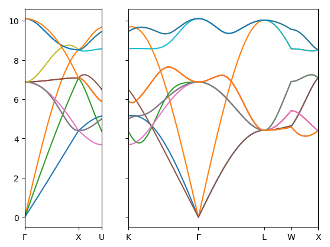
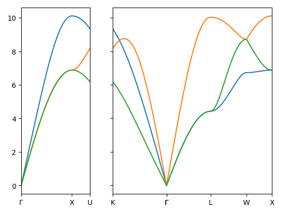
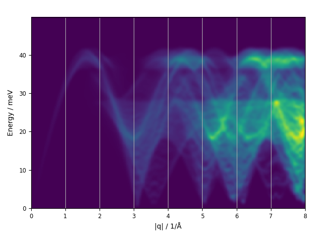

# Euphonic-Hiphive interfacing

Hiphive is a code for calculation and manipulation of high-order force-constant models. It interoperates with other codes, using ASE for its main structure representation. Currently most of the examples depend on Phonopy to compute eigenvalues etc.
Here we bring force constants computed with hiphive into Euphonic directly, and use them for INS simulation.
This is a proof-of-concept that can be extended to use temperature-dependent effective potentials.
To calculate phonon lifetimes hiphive can export force constants to another code such as Phono3py.

We start by following the basic tutorial to generate a model for FCC Ni with the EMT potential from ASE.


```python
import ase.build
from ase.calculators.emt import EMT
import ase.io
from ase.build.supercells import make_supercell, lattice_points_in_supercell
import numpy as np

prim = ase.build.bulk('Ni', cubic=True)
sc_matrix = np.eye(3) * 4
```

We generate training data by "rattling" a supercell of the ideal structure, calculating forces and writing to a file. This only takes a few seconds with EMT, but of course these could be batch-scheduled DFT calculations.


```python
from hiphive.structure_generation import generate_mc_rattled_structures

atoms_ideal = make_supercell(prim, sc_matrix)
cell_origins = lattice_points_in_supercell(sc_matrix)
rattled_structures = generate_mc_rattled_structures(atoms_ideal, 5, 0.03, 2.3)

for atoms in rattled_structures:
    atoms.calc = EMT()
    atoms.get_forces()
    
ase.io.write('prim.extxyz', prim)
ase.io.write('supercell_ideal.extxyz', atoms_ideal)
ase.io.write('supercells_rattled.extxyz', rattled_structures)
```

The system symmetry is analyzed with hiphive to create a cluster model. This will form the sparse parameter set for fitting. Three cutoffs are given here for 2-body, 3-body and 
4-body terms. Note that the harmonic approximation only considers the 2-body part; anharmonicity will be incorporated into the higher-order terms. This allows us to "get away" with larger displacements than a typical "direct method" approach, and also provides access to thermal effects and phonon lifetimes through further calculations.


```python
from hiphive import ClusterSpace, StructureContainer, ForceConstantPotential

rattled_structures = ase.io.read('supercells_rattled.extxyz', index=':')

cutoffs = [5.0, 4.0, 4.0]
cs = ClusterSpace(prim, cutoffs)
print(cs)
```

    Primitive cell:
        Formula: Ni
        Cell:
            [  0.00000   1.76000   1.76000]
            [  1.76000   0.00000   1.76000]
            [  1.76000   1.76000   0.00000]
        Basis:
            Ni  [  0.00000   0.00000   0.00000]
    
    Crystal symmetry:
        Spacegroup:          Fm-3m (225)
        Unique site:         1
        Symmetry operations: 48
        symprec:             1.00e-05
    
    Cutoffs:
        Maximum cutoff: 5.0
        Found 1 center atom with 54 images totaling 55 atoms
    
    Clusters:
        Clusters: {2: 55, 3: 97, 4: 303}
        Total number of clusters: 455
    
    Orbits:
        Orbits: {2: 5, 3: 5, 4: 11}
        Total number of orbits: 21
    
    Eigentensors:
        Eigentensors: {2: 13, 3: 22, 4: 146}
        Total number of parameters: 181
        Discarded orbits:
            (0, 0, 0)
    
    Constraints:
        Acoustic: True
        Number of degrees of freedom: {2: 12, 3: 19, 4: 88}
        Total number of degrees of freedom: 119
    =================== Cluster Space ====================
    Spacegroup                 : Fm-3m (225)
    symprec                    : 1e-05
    Sum rules                  : True
    Length scale               : 0.1
    Cutoffs                    :
    ========== Cutoffs ===========
     body/order |  2  |  3  |  4  
    ------------------------------
         1      |  -  |  -  |  -  
         2      | 5.0 | 4.0 | 4.0 
         3      |  -  | 4.0 | 4.0 
         4      |  -  |  -  | 4.0 
    ==============================
    Cell                       : Cell([[0.0, 1.76, 1.76], [1.76, 0.0, 1.76], [1.76, 1.76, 0.0]])
    Basis                      : [[0. 0. 0.]]
    Numbers                    : [28]
    Total number of orbits     : 20
    Total number of clusters   : 171
    Total number of parameters : 119
    ------------------------------------------------------
    order | n_orbits | n_clusters
    ------------------------------------------------------
      2   |      5   |      28
      3   |      4   |      38
      4   |     11   |     105
    ======================================================


The training data is now fed into the cluster model and parameters are optimised.


```python
from hiphive.utilities import prepare_structures
structures = prepare_structures(rattled_structures, atoms_ideal)
sc = StructureContainer(cs)
for structure in structures:
    sc.add_structure(structure)
print(sc)
```

    =============== Structure Container ================
    Total number of structures : 5
    Number of force components : 3840
    ----------------------------------------------------
    index | num-atoms | avg-disp | avg-force | max-force
    ----------------------------------------------------
     0    |    256    |  0.1294  |   1.6524  |   3.7407 
     1    |    256    |  0.1395  |   1.7285  |   4.6880 
     2    |    256    |  0.1296  |   1.5673  |   3.6984 
     3    |    256    |  0.1275  |   1.5965  |   5.0317 
     4    |    256    |  0.1243  |   1.6245  |   3.4472 
    ====================================================


```python
from trainstation import Optimizer
opt = Optimizer(sc.get_fit_data())
opt.train()
print(opt)
```

    ===================== Optimizer ======================
    seed                           : 42
    fit_method                     : least-squares
    standardize                    : True
    n_target_values                : 3840
    n_parameters                   : 119
    n_nonzero_parameters           : 119
    parameters_norm                : 0.9275019
    target_values_std              : 1.027693
    rmse_train                     : 0.01667685
    rmse_test                      : 0.01975875
    R2_train                       : 0.9997333
    R2_test                        : 0.9996649
    AIC                            : -28057.89
    BIC                            : -27326.29
    train_size                     : 3456
    test_size                      : 384
    ======================================================


To access properties a "ForceConstantPotential" object is constructed. This can map atomic to clusters and the resulting energy terms; by providing the supercell structure we can get a traditional 2-D force constants matrix.


```python
fcp = ForceConstantPotential(cs, opt.parameters)
fcp.write('fcc-nickel.fcp')
print(fcp)

fcs = fcp.get_force_constants(atoms_ideal)
fc2 = fcs.get_fc_array(2)
```

    =============== ForceConstantPotential ===============
    Spacegroup Fm-3m (225)
    Cell:
    Cell([[0.0, 1.76, 1.76], [1.76, 0.0, 1.76], [1.76, 1.76, 0.0]])
    Basis:
    [[0. 0. 0.]]
    Numbers: [28]
    Cutoff matrix:
    [[ 5.  4.  4.]
     [nan  4.  4.]
     [nan nan  4.]]
    Order 2, #orbits 5, #cluster 28, #parameters 12
    Order 3, #orbits 4, #cluster 38, #parameters 19
    Order 4, #orbits 11, #cluster 105, #parameters 88
    Total number of orbits: 20
    total number of clusters: 171
    total number of parameters: 119
    ======================================================


At this point one would usually use Phonopy to compute properties, but instead we will use Euphonic. However, Euphonic uses a different convention to define force constants and we need to map the (N, N, 3, 3) data to (N/n, 3n, 3n) where n and N are the number of atoms in primitive cell and supercell respectively.


```python
from euphonic import ForceConstants, Crystal, ureg
```


```python
int_cell_origins = np.asarray(cell_origins.dot(sc_matrix), dtype=int)
```


```python
natoms = len(prim)
fc2_slice = np.empty([len(int_cell_origins), natoms*3, natoms*3])
for cell_origin, _ in enumerate(int_cell_origins):
    data = fc2[cell_origin * natoms: (cell_origin + 1) * natoms]
    fc2_slice[cell_origin] = data[:, :natoms, :, :].swapaxes(1, 2).reshape(3 * natoms, 3*natoms)
```


```python
crystal = Crystal(prim.cell.array * ureg('angstrom'),
                  prim.get_scaled_positions(),
                  np.asarray(prim.get_chemical_symbols()),
                  prim.get_masses() * ureg('amu'))
fc = ForceConstants(crystal, fc2_slice * ureg('eV/angstrom**2'), sc_matrix, int_cell_origins)
```


```python
fc.to_json_file('take1_fc.json')
```

    Written to /home/adam/Nextcloud/Notebooks/euphonic-hiphive/take1_fc.json


```python
from euphonic.cli.utils import _bands_from_force_constants
from euphonic.plot import plot_1d

def fc_to_band_plot(fc: ForceConstants):
    modes, labels, split_kwargs = _bands_from_force_constants(fc, q_distance=(0.01*ureg('1/angstrom')))
    modes.reorder_frequencies()
    modes.frequencies_unit = 'THz'
    dispersion = modes.get_dispersion().split(**split_kwargs)
    
    _ = plot_1d(dispersion)
    
fc_to_band_plot(fc)
```

    Computing phonon modes: 12 modes across 796 q-points


    

    


The lines are clean and the overall range agrees with the Phonopy workflow, but we have some band-folding due to the incorrect definition of unit cell and supercell. We can fix this by crafting an appropriate supercell and passing it to the FCP. It doesn't have to be the same as the training supercell, it just has to be big enough to contain the FCP.


```python
prim = fcp.primitive_structure
natoms = len(prim)
# This cubic cell would be nice but doesn't work at the moment...
# sc_matrix = np.asarray([[-1, 1, 1], [1, -1, 1], [1, 1, -1]], dtype=int) * 4
sc_matrix = np.eye(3, dtype=int) * 6
supercell = make_supercell(prim, sc_matrix)
cell_origins = lattice_points_in_supercell(sc_matrix)

fcs = fcp.get_force_constants(supercell)
fc2 = fcs.get_fc_array(2)
```


```python
# Might need to transpose sc_matrix, here it is symmetric so doesn't matter
int_cell_origins = np.asarray(cell_origins.dot(sc_matrix), int)

fc2_slice = np.empty([len(int_cell_origins), natoms*3, natoms*3])
for cell_origin, _ in enumerate(int_cell_origins):
    data = fc2[cell_origin * natoms: (cell_origin + 1) * natoms]
    fc2_slice[cell_origin] = data[:, :natoms, :, :].swapaxes(1, 2).reshape(3 * natoms, 3*natoms)
    
crystal = Crystal(prim.cell.array * ureg('angstrom'),
                  prim.get_scaled_positions(),
                  np.asarray(prim.get_chemical_symbols()),
                  prim.get_masses() * ureg('amu'))
fc = ForceConstants(crystal, fc2_slice * ureg('eV/angstrom**2'), sc_matrix, int_cell_origins)
```

We write the ForceConstants as a Euphonic .json file for ease of use with the command-line tools.


```python
fc.to_json_file('take2_fc.json')
```

    Written to /home/adam/Nextcloud/Notebooks/euphonic-hiphive/take2_fc.json


```python
modes, labels, split_kwargs = _bands_from_force_constants(fc, q_distance=(0.01*ureg('1/angstrom')))
modes.reorder_frequencies()
modes.frequencies_unit = 'THz'
dispersion = modes.get_dispersion().split(**split_kwargs)
_ = plot_1d(dispersion)
```

    Computing phonon modes: 3 modes across 796 q-points


    

    


For a diagonal supercell of the primitive, things look fine. I am having a bit more trouble with a non-diagonal supercell derived from the conventional cell; perhaps the `lattice_points_in_supercell` routine is not giving things in the expected order?

Anyway, we can now use this for neutron simulations with Euphonic:


```bash
%%bash

euphonic-powder-map take2_fc.json -s powder_plot.png \
    --weighting coherent --energy-broadening 1 --q-broadening 0.1 \
    --energy-unit meV --no-widget --q-max 8
```

    ForceConstants data was loaded
    Setting up dimensions...
    Sampling 320 |q| shells between 0.0 1/Å and 8.0 1/Å


    100%|██████████| 320/320 [00:23<00:00, 13.60it/s]


    Final npts: 1000
    Plotting figure: max intensity 5.359080043536842 mb/meV
    Saved plot to /home/adam/Nextcloud/Notebooks/euphonic-hiphive/powder_plot.png





```python

```
