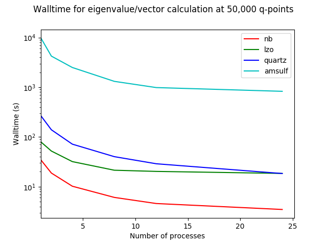
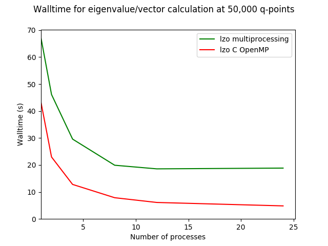
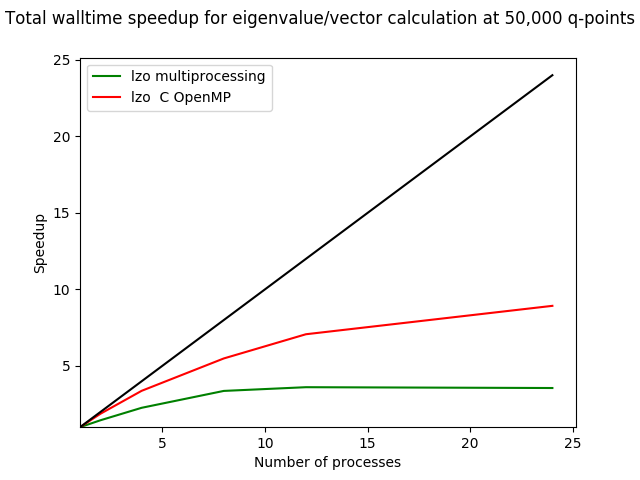
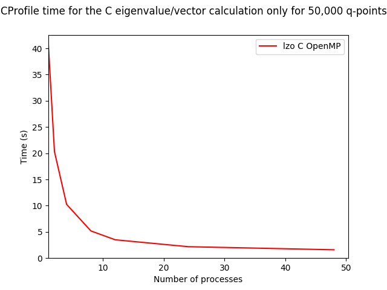

# Parallelism In Euphonic

Euphonic will implement shared memory parallelism (SMP) on a single node, as it
is planned that any more complex parallelism that is required (e.g. when
generating entire S(Q, w) objects) will happen through Horace.

Due to Python's global interpreter lock which prevents multiple Python threads
from performing computations simultaneously implementing SMP even on
embarrassingly parallel problems isn't as simple as putting a directive around
a for loop. However there are a few options for getting round this:

* Write the parallelisable parts in **C/C++ using OpenMP** directives and
interface with Python (using CPython API, ctypes or PyBind11 for example). This
could provide good performance improvements but implementing complex algorithms
like the Ewald sum is nontrivial, and Euphonic would no longer be pure Python
so not as easy to distribute.
* Use a library such as **Numba** to parallelise the most computationally
expensive loops. This is easy to use, but doesn't support Numpy's Einsum, which
Euphonic uses for a lot of it's calculations. After changing some loops to
avoid using Einsum and parallelising them, I found I couldn't get a performance
increase, possibly because Einsum is already highly optimised. Also, it doesn't
really make sense to parallelise over small loops, when the entire problem is
easily parallelisable over q-points.
* Use Python's built-in **multiprocessing** module, which spawns multiple
Python processes which act as threads. This is easy to implement over the
existing code and keeps Euphonic as pure Python. However, processes are
relatively heavyweight and because of the way Multiprocessing works you have to
implement some workarounds to get it to work with more complex OO code (e.g.
Multiprocessing pickles objects to send them between processes, and by default
methods bound to classes can't be pickled in Python 2. A small function is
required to overwrite the default pickling to enable _calculate_phonons_at_q
method bound to the InterpolationData class to be pickled)

## Implementation

I initially decided to implement parallelism using Python's multiprocessing
module as it was quick and easy to implement, however I found it had a lot of
limitations and the scaling was disappointing. For more details see
[Python Multiprocessing](#Python-Multiprocessing) below.

Due to the listed issues with Python Multiprocessing I have instead started to
investigate writing the loop over Q-points with C and OpenMP using the CPython
API. For details see [CPython API and OpenMP](#CPython-API-and-OpenMP)

## Python Multiprocessing

I initially decided to use Python multiprocessing as it is quick and easy to
implement, and you can parallelise over the whole (slightly complex)
_calculate_phonons_at_q function rather than over small loops. As the q-points
are independent, I decided to use multiprocessing.pool.map.

I have profiled an eigenvalue/vector calculation over 50,000 q-points on
Scarf18 nodes (Intel Gold 6126) for La2Zr2O7, Niobium, Quartz and Ammonium
Sulphate for different numbers of processors:

This profiling was done with a MKL-linked Numpy with the number of threads set
to 1, and turbo boost turned off. However, the scaling is still not linear, and
Quartz and AmSulf scale much better than LZO and Nb. Quartz and AmSulf are
dielectric materials so most of the computational time is spent calculating the
Ewald dipole correction, whereas in LZO and Nb most of the time is spent
creating and diagonalising the dynamical matrix. See the following table:

|      |Ewald Sum      |Create Dyn Mat |Diagonalise Dyn Mat|Total time|
|------|---------------|---------------|-------------------|----------|
|LZO   |-              |24.87s (26.2%) |39.78s (42.0%)     |94.77s    |
|Nb    |-              |20.76s (51.0%) |2.58s (6.3%)       |40.71s    |
|Quartz|266.22s (73.1%)|65.21 (17.9%)  |11.77s (3.2%)      |364.07s   |
|AmSulf|7173.75 (78.3%)|1606.60 (17.5%)|259.39 (2.8%)      |9162.34s  |

The scaling may also depend on the number of ions/cells, summarised in the
following table:

|      |Number of Ions|Number of Cells in Supercell|
|------|--------------|----------------------------|
|LZO   |22            |4                           |
|Nb    |1             |1728                        |
|Quartz|9             |100                         |
|AmSulf|60            |60                          |

One possible reason for scaling being poorer for LZO is as the diagonalisation
is a very well optimised algorithm, it will make good use of the cache, and
having multiple processes competing for the same cache may reduce its
effectiveness. Scaling probably becomes poor for Nb as the benchmark is
probably too short (~5s with 24 procs) so initialising the multiprocessing may
take a significant portion of the run time.

**Note: Scaling on IDAaaS**
I've done some initial profiling on IDAaaS, and for some reason the scaling is
very poor. Even with Quartz (the best scaling material on the graph above)
performance improvement is only seen up to 2 processors. Using more than 2
doesn't give any further performance improvement, whether on an Excitations or
Excitations Large machine. In addition, using any more than 1 thread for
Openblas is extremely detrimental to performance. I'm still investigating why
it won't give performance benefits beyond 2 processors. 

## Multiprocessing Disadvantages
* **Windows/Linux differences**
    - On Linux, os.fork() is used bymultiprocessing to create new processes,
    but this isn't supported on Windows, so instead os.spawn() is used to
    create entirely new processes. This can cause a few issues:
    - Shared memory arrays (e.g. to hold eigenvectors) can't be used, as on
    Windows the spawned processes can't modify the same memory. So the
    eigenvectors have to instead be returned from the multiprocessing pool,
    which wastes computation as then the results from all the processes have to
    be stacked into a single array. Also, this can cause a MaybeEncodingError
    if the eigenvectors from too many q-points are returned at once. However, I
    have only seen this for AmSulf for 2 processors and 50,000 q-points. A
    chunking keyword argument was implemented to get around this.
    - This means that each process that is spawned has to import the main
    Python script, so if the original script is not contained within an
    `if __name__ == '__main__'` block, this can lead to processes recursively
    being spawned, see 'Safe importing of main module'
    https://docs.python.org/2/library/multiprocessing.html#windows
    - Functions need to be pickleable to be sent between processes, so to
    enable pickling of _calculate_phonons_at_q (a method bound to the
    InterpolationData class) the pickling function needs to be modified with an
    ugly bit of code.
* **Stopping execution** - If the Python script is exited (e.g. ctrl + C) while
multiple processes are running, it may fail to exit properly, with unexpected
results such as recursively throwing errors, or silently keeping orphaned
Python processes running, which then need to be killed manually
* **MATLAB integration** - Officially, Matlab doesn't support Python
multiprocessing, it seems to work fine when run through Matlab 2019a (it
doesn't work for older versions unless a small alteration is made to the
`toolbox/matlab/external/interfaces/python/+python/+internal/redirectstdout.m`
file). In addition, it appears that on IDAaaS, multiprocessing actually spawns
multiple Matlab (rather than Python processes). This uses more memory (and
maybe more licenses?) but I'm not sure what causes this currently. Running on
Windows they show up as Python processes.

## CPython API and OpenMP
I have made an initial implementation of calculating and diagonalising the
dynamical matrix (no reciprocal ASR or dipole correction) using the CPython API
and done some initial benchmarking for LZO for 50,000 q-points.

Comparison of total walltimes and speedup for the Python multiprocessing
implementation and C API with OpenMP implementation:

The speedup shown isn't necessarily representative as this is total walltime,
so includes the single threaded Python parts (e.g. file reading, initialisation
of objects). I have use CProfile to get the time for just the C function that
calculates and diagonalises the dynamical matrix:

