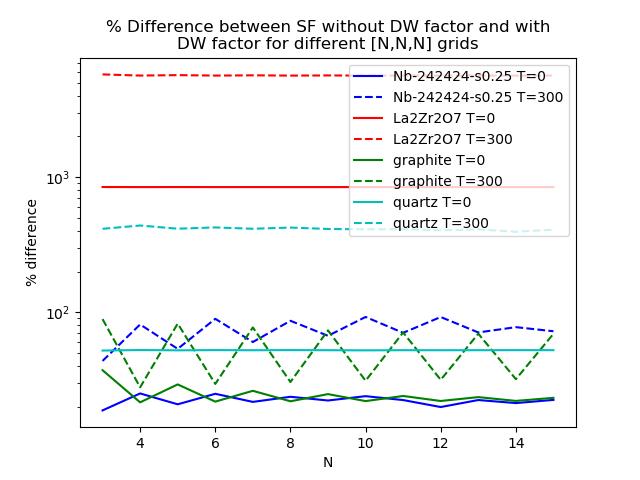
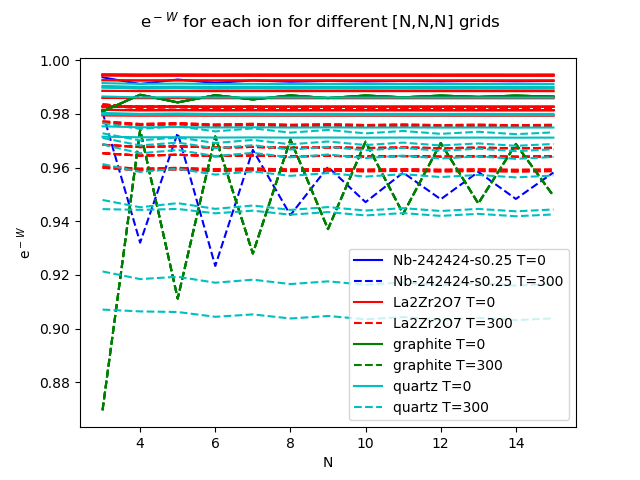
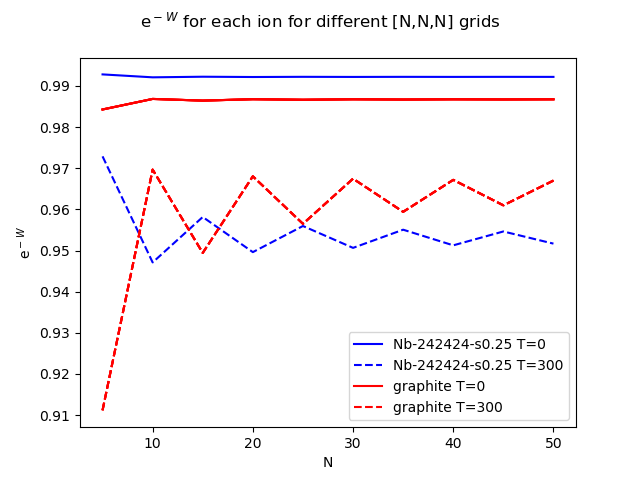
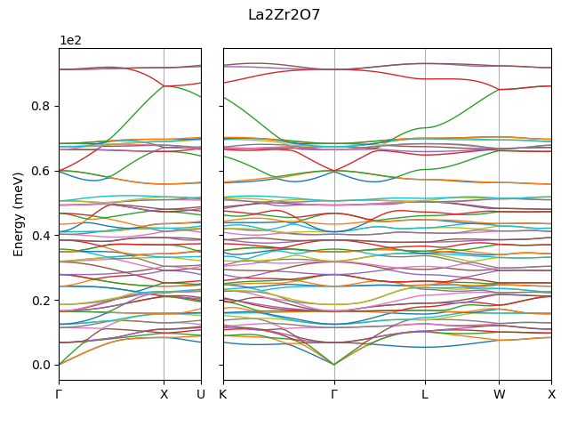
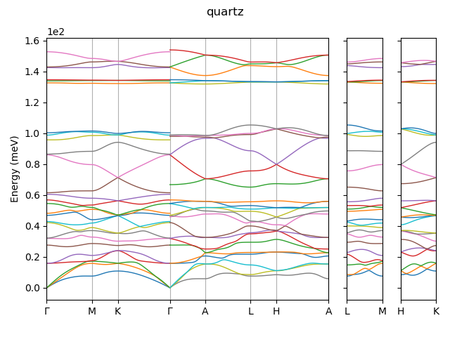
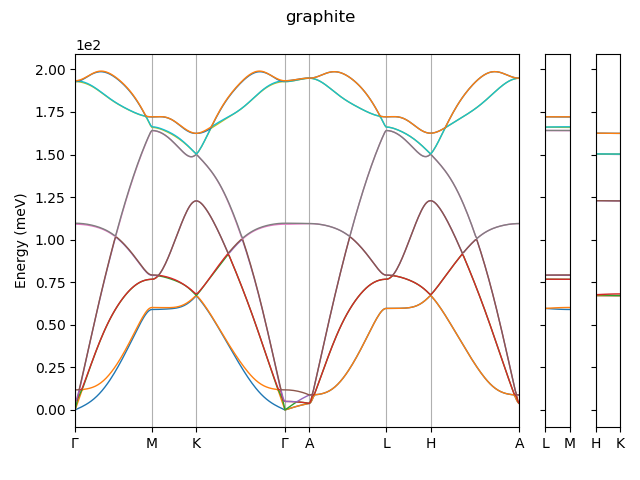
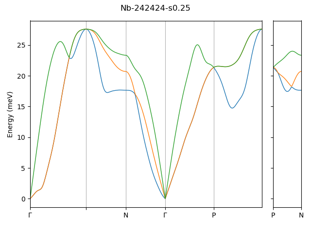

## Debye-Waller factor

The Debye-Waller factor forms a part of the structure factor calculation and
requires summation over the 1st BZ (for details see
[algorithms - 3.](../design/04_algorithms.md). Investigating convergence of the
Debye-Waller factor with different grid densities is important as a carefully
chosen grid could increase performance without changing the result.

To test the convergence of the Debye-Waller factor with different BZ sampling,
I calculated the structure factor for a 20x20x20 Monkhorst-Pack grid between -5
and 5 (I wanted to also try points outside the first BZ) with and without the
DW factor. I took the mean percentage difference between the structure factor
with and without the DW factor for different DW grids. In theory, if the BZ
sampling has been sufficient this value should plateau as finer grids should
give the same answer. The percentage difference for different materials can be
seen in the following figure:

This is surprising, the DW factors for Graphite and Nb are clearly not
converged even on a 15^3 grid. They also heavily depend on whether N is even or
odd. (It's also strange that the average % difference for lzo is in the
thousands, this is because at specific branches at specific q-points where the
intensity is small, the intensity actually increases with application of the DW
factor due to there being a slightly different cancellation between large
numbers when adding up the branches, resulting in the intensity being orders of
magnitude bigger, increasing the mean. These magnified intensities are still
orders of magnitude below the other intensities though so I don't think it's
anything to worry about).  

I then calculated e^-W term for each atom (assuming Q=[1.0, 1.0, 1.0] for
simplicity) and plotted these to check. It shows a similar picture:

For Graphite and Nb I extended this out to 50^3:

Surprisingly even with a 50x50x50 grid Nb and Graphite are barely only
constrained to within 1%. This could be due to LZO and Quartz having much
flatter bandstructures than Nb and Graphite. Sample bandstructures below:

Careful consideration of the DW grid needed for different materials might be
required.