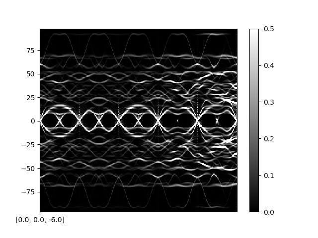
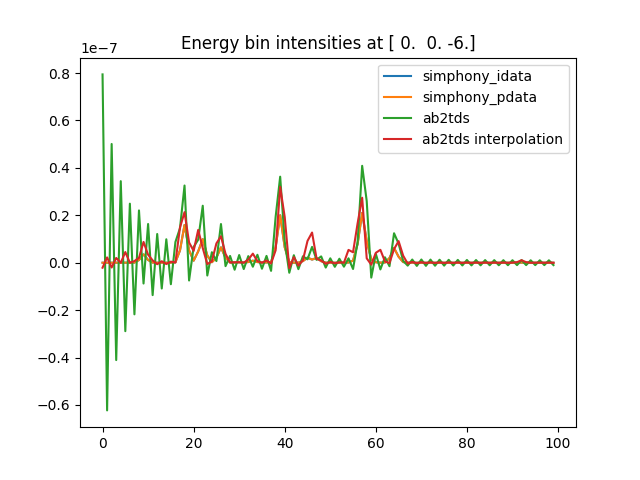
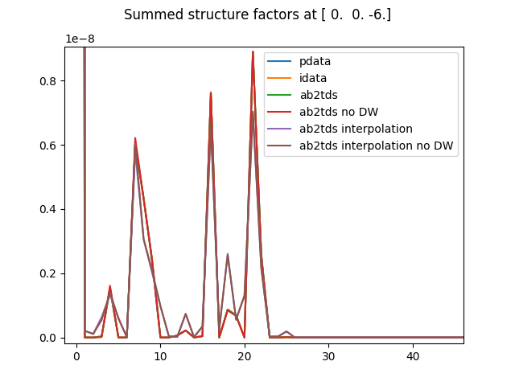

[Ab2tds Docs](http://ftp.esrf.fr/scisoft/AB2TDS/)  

# Running Ab2tds
## Preprocessing steps
Ab2tds has a few different steps to the calculation (BZ zone reconstruction, DW factor) and each needs specific parameters to match the Euphonic calculation. Each step outputs an .md5 file that must be used as input for the next step:

**BZ Reconstruction**
An example of this input can be found in `lzo/ab2tds/symmetry_input` in the repo (docs [here](http://ftp.esrf.fr/scisoft/AB2TDS/zone_reconstruction.html)). Required params:
* `APPLYTIMEREVERSAL = 0` Not sure whether this has an effect on the result
* `CALCULATECOMPLEMENT = 0` Don't know what this does
* `energy_scaling = 1.0`

**Debye-Waller factor**  
An example of this input can be found in `lzo/ab2tds/dw_input` in the repo (docs [here](http://ftp.esrf.fr/scisoft/AB2TDS/debye_waller.html)). Required params:
* `APPLYTIMEREVERSAL = 0` Not sure whether this has an effect on the result
* `Temperature = 100`

**Fourier Interpolation of Dynamical Matrix**  
An example of this input can be found in `lzo/ab2tds/fourier_input` in the repo (docs [here](http://ftp.esrf.fr/scisoft/AB2TDS/dynamicalFT.html)). This step might not be required if you're not using interpolation - need to test this. Required params:
* `APPLYTIMEREVERSAL = 0` Not sure whether this has an effect on the result
* `Nfour_interp = 4` This mostly depends on whether you're using Ab2tds to calculate structure factors with or without interpolation. If with interpolation I've found Nfour_interp = 4 on a CASTEP grid with phonon_fine_kpoint_mp_spacing = 0.005 works well for LZO. For insulators such as Quartz which have a longer range force constants matrix, I haven't yet found an mp_spacing/Nfour_interp combination that gives very accurate results

## S(Q,w) map calculation
### Without Interpolation  
This requires a .phonon file for the q-points you want to plot, a q-point grid file that has had the above preprocessing steps to be turned into an .md5 file and an input parameter file. Run with:  
`make_TDS_DispersionIntensityCurvesClone qpt_cut.phonon input_param_file qpt_grid.md5`   
An example input parameter file is at `lzo/ab2tds/fourier_input/011_scan/intensity_map_input.py`. This input file needs to match the specific cut you are simulating (docs [here](http://ftp.esrf.fr/scisoft/AB2TDS/DispersionIntensityCurvesClone.html)). Required params:
* `APPLYTIMEREVERSAL=0` Not sure whether this has an effect on the result
* `Temperature=100`
* `resolutionfile='resolution.txt'` A file with 2 columns; the energy in cm-1 and the value of the resolution function. 
  For benchmarking purposes, we don't want to apply a resolution function at all as that's not what we're testing. To try 
  and convolve with a delta function I tried:  
  ```-4  0.000000e+00
  -3  0.000000e+00
  -2  0.000000e+00
  -1  0.000000e+00
   0  1.000000e+00
   1  0.000000e+00
   2  0.000000e+00
   3  0.000000e+00
   4  0.000000e+00
   5  0.000000e+00
  ```
  But this still seems to leave some zig-zag artefacts on the S(Q,w) map. For benchmarking it is perhaps better to look at 
  the raw structure factors for each branch, which are output in the `alongthelineF.dat` file
* `Saturation=0.5` only affects the saturation in the displayed image, not in the data output to files, so doesn't really 
  matter what this value is
* `lowerLimit=0` This also only affects the displayed image, just set to 0
* `bottom_meV=0` Setting to 0 ignores negative frequencies
* `NEUTRONCALC=1` Needs to be set to 1 for neutron scattering (otherwise it does x-ray)
* `CohB={'La': 8.24, 'Zr': 7.16, 'O': 5.803}` This must be specified if NEUTRONCALC=1. A dictionary containing the coherent scattering lengths for each atom type
* `NeutronE=100` **NOTE: Euphonic doesn't use the incident energy in its calculations, so to compare with Ab2tds, the 
  following lines must be altered in the `make_TDS_DispersionIntensityCurvesClone.py` and 
  `make_TDS_DispersionIntensityCurves.py` scripts.** Replace:
  ```
  kinstokes = numpy.sqrt(numpy.maximum( (NeutronE-evals*(0.0001239852 *1000))/NeutronE, 0.0 ))
  kinantistk= numpy.sqrt((NeutronE+evals*(0.0001239852 *1000))/NeutronE)
  ```
  with
  ```
  kinstokes = 1.0
  kinantistk= 1.0
  ```
  so this parameter actually doesn't matter
* `branchWeight=np.ones(3*n_ions).tolist()` We want all phonon branches to be weighted the same, so use Numpy to make an 
  array of ones the same length as the number of branches
* `EigScal=0` Must be set to 0 (or, actually, any number except 1 or 2) for a neutron calculation
* `UniqueIon=-1` We want to use all ions in the calculation so set to -1  
**NOTE: the following 3 parameters are not documented as being required for S(Q,w) without interpolation but I've found they actually are required**
* `redStarts=[[0.0, 0.0, -6.0]]` - 2D array as its supposed to be an array of q-point starts for when you want to plot 
  multiple sections in reciprocal space. I've only used it for a single section, and set this as the first q-point in the 
  .phonon file
* `redEnds=[[0.0, 10.0, 4.0]]` - same as redStarts but for the last q-point in the .phonon file
* `Nqlines=[501]` - this is the number of q-points in the .phonon file. Again this is supposed to be the number of q- 
  points in each section that you want to plot, but I'm only plotting one section. That's why this value is a list rather 
  than just an integer.  

### With Interpolation  
This requires a q-point grid file that has had the above preprocessing steps to be turned into an .md5 file, and an input parameter file. Run with:  
`make_TDS_DispersionIntensityCurves qpt_grid.md5 input_param_file`   
An example input parameter file is at `lzo/ab2tds/fourier_input/011_scan/intensity_map_interpolation_input.py`. This input file needs to match the specific cut you are simulating (docs [here](http://ftp.esrf.fr/scisoft/AB2TDS/DispersionIntensityCurves.html)). I will only list the params that are different to the S(q,w) without interpolation calculation:
* `Nfour_interp=4` Set this to whatever was set in the 'Fourier interpolation of the dynamical matrix' preprocessing step
* `tth_max=45` This parameter isn't mentioned in the documentation but in the code is documented as 'When searching for 
  maximum contrast angles, the maximum 2theta angle achievable on the beamline'. This is used to calculate contrast in the 
  displayed image (_I think_) so shouldn't have any effect on the output, set to the default of 45.
* `Nqlines=[500]` - redStarts and redEnds can be set to the same as S(Q,w) without interpolation, but in this case Nqlines must actually be set as **number of q-points - 1**

# Ab2tds Output
Ab2tds has many output files, examples can be seen in the benchmarking repository at `lzo/ab2tds/011_scan/outputs/`. The most useful ones are:
* `res.dat` Contains the S(Q,w) map with resolution, each row is an energy bin and each column is a q-point
* `alongthelineF.dat` Contains the raw (non energy-binned) structure factors for each branch and q-point. Each row is a q-point and each column is a branch


# Comparing Euphonic and Ab2tds

## Visual comparison
The following shows an example output from both Ab2tds and Euphonic for an LZO cut at T=100K:  

|Ab2tds|Euphonic|
|------|--------|
|||

These look fairly similar, but if you inspect the intensities more closely at a particular q-point (especially gamma points), the intensities are actually not that similar and there are zig-zag artefacts, which most likely results from the resolution convolution. This can be seen in the following figure:



To account for this, the raw structure factors in `alongthelineF.dat` can be looked at instead. They have very good agreement, except the Ab2tds interpolation at the gamma points:

 

## Numeric comparison
There are some ~terrible~ scripts for comparing Ab2tds and Euphonic output in the benchmarking repository. The ones for LZO can be found in the `lzo/ab2tds` directory
* `check_ab2tds_data.py` This compares the energy binned output from res.dat with the output from Euphonic's calculate_sqw_map function for one of the cuts in the directory (e.g. for LZO 011_scan or 0-1-1_scan). The Ab2tds data shows zig-zag artefacts due to the resolution function (I haven't figured out how to prevent this yet) so this probably isn't the best comparison
* `check_ab2tds_sf.py` This compares the raw structure factors from alongthelineF.dat with the output from Euphonic's calculate_structure factor function for one of the cuts in the directory (e.g. for LZO 011_scan or 0-1-1_scan). This script also checks the frequencies of each branch for degeneracies and compares the **summed** structure factor for these degenerate branches to account for the fact that the degenerate eigenvectors will be arbitrarily mixed. This prints out the minimum, maximum and mean percentage different between the structure factor calculations for Euphonic's PhononData, Euphonic's InterpolationData, Ab2tds without interpolation, and Ab2tds with interpolation. It also plots the structure factors for those cases at a few arbitrary q-points so the difference can be seen visually.
## Performance benchmarking
It is difficult to directly compare performance as there are many different steps and it depends whether you're comparing Euphonic just reading from a .phonon file, or reading from a .castep_bin file and interpolating, and whether it's Ab2tds with or without interpolation. There is some initial timing data (for LZO) in `lzo/ab2tds/profiling` for Ab2tds.

For each different case the steps that would need to be taken into account and timed would be:  
**Ab2tds without interpolation**  
`Running CASTEP on a q-point grid sufficient for DW factor` -> `Running CASTEP on the q-point path of interest` -> `Reconstruction of BZ` -> `DW factor calculation` -> `Fourier interpolation` -> `Running make_TDS_DispersionIntensityCurvesClone`  
**Ab2tds with interpolation**  
`Running CASTEP on a q-point grid sufficient for DW factor and interpolation` -> `Reconstruction of BZ` -> `DW factor calculation` -> `Fourier interpolation with sufficient Nfour_interp` -> `Running make_TDS_DispersionIntensityCurves`